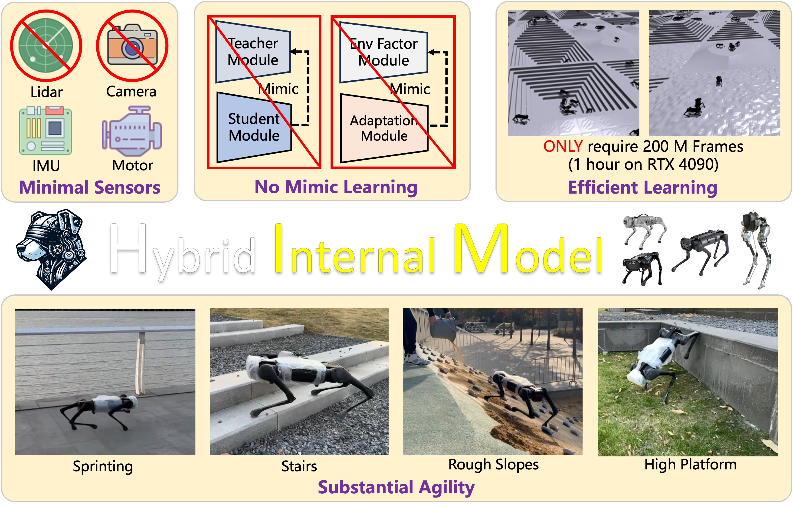
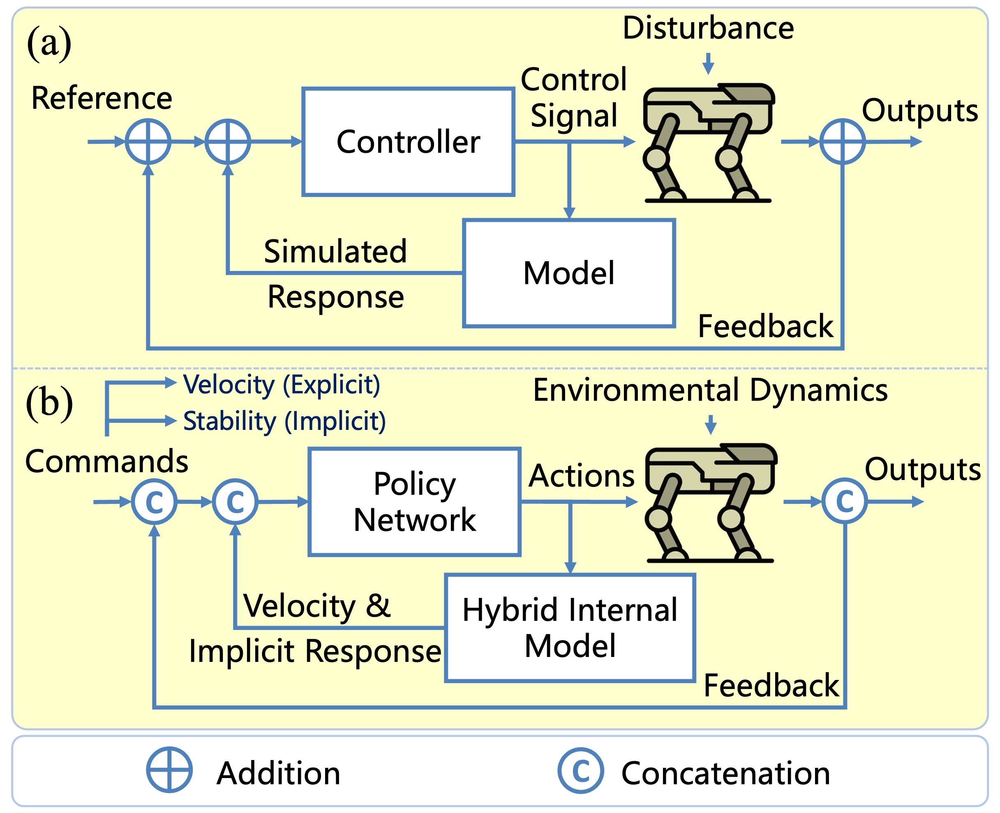
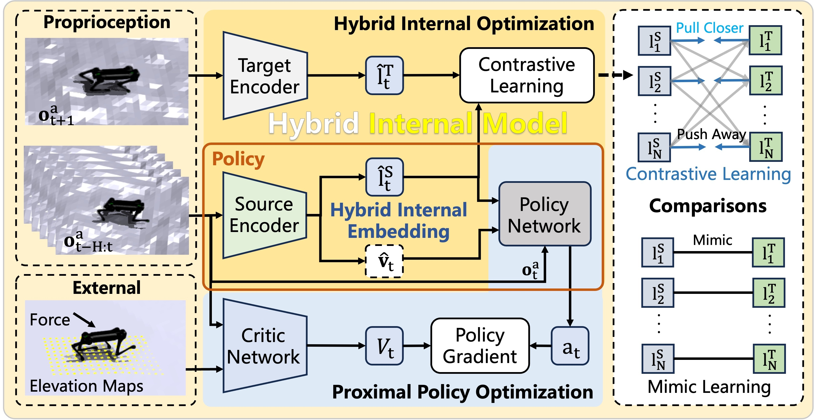
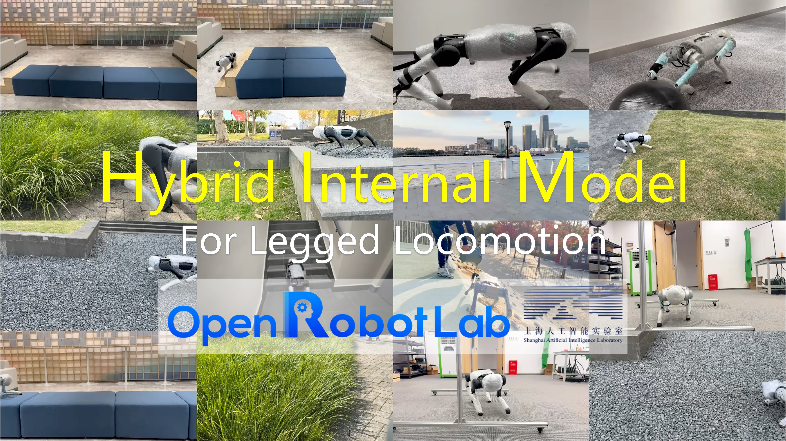

<br>
<p align="center">
<h1 align="center"><strong>Hybrid Internal Model: A Simple and Efficient Learner for Agile Legged Locomotion</strong></h1>
  <p align="center">
    <a href='https://github.com/Junfeng-Long/' target='_blank'>Junfeng Long*</a>&emsp;
    <a href='https://github.com/Wongziseoi/' target='_blank'>Zirui Wang*</a>&emsp;
    <a href='https://quanyili.github.io' target='_blank'>Quanyi Li</a>&emsp;
    <a href='https://scholar.google.com/citations?user=NJxUNrcAAAAJ&hl=en' target='_blank'>Jiawei Gao</a>&emsp;
    <a href='http://zhangwenwei.cn/' target='_blank'>Liu Cao</a>&emsp;
    <a href='https://daibo.info/' target='_blank'>Jiangmiao Pang</a>&emsp;
    <br>
    Shanghai AI Laboratory&emsp;Zhejiang University&emsp;Tsinghua University
  </p>
</p>

<p align="center">
  <a href="https://arxiv.org/abs/" target='_blank'>
    
  </a> 
  <a href="./assets/HIMLocomotion.pdf" target='_blank'>
    
  </a> 
  <a href="https://junfeng-long.github.io/HIMLoco" target='_blank'>
    
  </a>
</p>

## 🏠 About
<!--  -->
<div style="text-align: center;">
    
</div>
This paper presents a Hybrid Internal Model (HIM) based method for legged locomotion control in quadruped robots. The method aims to address the limitations of existing learning-based locomotion control paradigms, which suffer from information losses, noisy observations, sample efficiency, and difficulties in developing general locomotion policies for robots with different sensor configurations. The proposed HIM method leverages joint encoders and an Inertial Measurement Unit (IMU) as the only sensors for predicting robot states. Our framework consists of two components: the information extractor HIM and the policy network. Unlike previous methods that explicitly model environmental observations such as ground elevation, friction, restitution, etc, HIM only explicitly estimates velocity and implicitly simulates the system response as an implicit latent embedding, with velocity and this embedding, the policy can estimate the environmental disturbance then perform robust locomotion control. The embedding is learned through contrastive learning, which enhances robustness and adaptability in disturbed and unpredictable environments. The proposed method is validated through simulations in different terrains and real-world experiments on the Unitree robots. The results demonstrate that HIM achieves substantial agility over challenging terrains with minimal sensors and fast convergence.

## 🔥 News
- [2023-12] We release the [paper](https://arxiv.org/abs/) of HIMLoco. Please check the :point_right: [webpage](https://junfeng-long.github.io/HIMLoco/) :point_left: and view our demos! :sparkler:;

## 🔍 Overview

### Modeling
<p align="center">
  
</p>
The classical Internal Model Control(IMC) suggests that we can perform robust control without directly modeling the disturbance. As shown in the above figure, it uses an internal model to simulate the system response and further estimate the system disturbance, increasing the closed-loop stability. The more accurate the internal model is, the more robust control it can perform. 
In the context of locomotion, the system disturbance from the environment can be estimated from the response of the robot. Therefore, we consider external environmental properties such as elevation maps, ground friction, and ground restitution as disturbances, and do not exploit them for modeling. As shown in the figure, we modify the original IMC for the locomotion task. The commands contain the reference velocity of our robot, however, there also exists an underlying command that requires the robot to keep stable through the whole process. To achieve a closed-loop control system, we need feedback containing the robot's velocity and an implicit response indicating stability that can not be directly accessed from the robot. Following the principles of the IMC framework, we can build an internal model that can simulate the robot's velocity and the implicit response indicating stability. With this model, we can estimate the disturbance brought by the environment and perform robust locomotion control.

### Framework
<p align="center">
  
</p>
The policy network receives partial observations and the hybrid internal embedding, which is optimized to be close to the robot's successor state where the response of the robot system is naturally embedded, we use contrastive learning in this process to utilize batch-level information and deal with noise.

### [Demo](https://junfeng-long.github.io/HIMLoco/)
[](https://junfeng-long.github.io/HIMLoco/)

## 🔗 Citation

If you find our work helpful, please cite:

```bibtex
@article{xiao2023unified,
  author    = {Long, Junfeng and Wang, Zirui and Li, Quanyi and Gao, Jiawei and Cao, Liu and Pang, Jiangmiao},
  title     = {Hybrid Internal Model: A Simple and Efficient Learner for Agile Legged Locomotion},
  journal   = {Arxiv},
  year      = {2023},
}
```

## 📄 License
<a rel="license" href="http://creativecommons.org/licenses/by-nc-sa/4.0/"></a>
<br />
This work is under the <a rel="license" href="http://creativecommons.org/licenses/by-nc-sa/4.0/">Creative Commons Attribution-NonCommercial-ShareAlike 4.0 International License</a>.

## 👏 Acknowledgements
- [legged_gym](https://github.com/leggedrobotics/legged_gym): Our codebase is built upon legged_gym.
