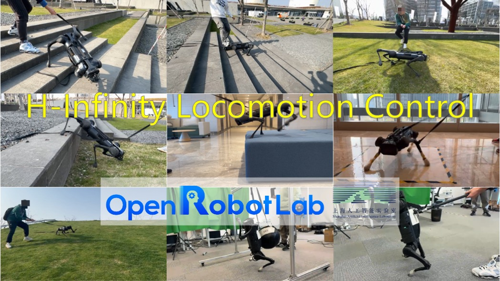
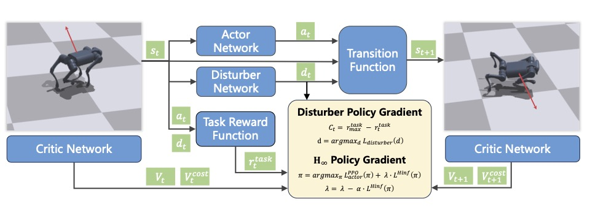

 

<h1 align="center"><strong>Learning H-infinity Locomotion Control</strong></h1>
  

    <a href='https://junfeng-long.github.io' target='_blank'>Junfeng Long*</a>&emsp;
    <a href='https://github.com/Virlus/' target='_blank'>Wenye Yu*</a>&emsp;
    <a href='https://quanyili.github.io' target='_blank'>Quanyi Li</a>&emsp;
    <a href='https://github.com/Wongziseoi/' target='_blank'>Zirui Wang</a>&emsp;
    <a href='http://dahua.site/' target='_blank'>Dahua Lin</a>&emsp;
    <a href='https://oceanpang.github.io' target='_blank'>Jiangmiao Pang</a>&emsp;
     
    Shanghai AI Laboratory&emsp;Zhejiang University&emsp;Tsinghua University
  

   
   
  

## [Demo](https://junfeng-long.github.io/HINF/)

## 🏠 About
Stable locomotion in precipitous environments is an essential capability of quadruped robots, demanding the ability to resist various external disturbances. However, recent learning-based policies only use basic domain randomization to improve the robustness of learned policies, which cannot guarantee that the robot has adequate disturbance resistance capabilities. In this paper, we propose to model the learning process as an adversarial interaction between the actor and a newly introduced disturber and ensure their optimization with H-infinity constraint. In contrast to the actor that maximizes the discounted overall reward, the disturber is responsible for generating effective external forces and is optimized by maximizing the cost in each iteration. To keep joint optimization between the actor and the disturber stable, our H-infinity constraint mandates the bound of ratio between the cost to the intensity of the external forces. Through reciprocal interaction throughout the training phase, the actor can acquire the capability to navigate increasingly complex physical disturbances. We verify the robustness of our approach on quadrupedal locomotion tasks with Unitree Aliengo robot, and also a more challenging task with Unitree A1 robot, where the quadruped is expected to perform locomotion merely on its hind legs as if it is a bipedal robot. The simulated quantitative results show improvement against baselines, demonstrating the effectiveness of the method and each design choice. On the other hand, real-robot experiments qualitatively exhibit how robust the policy is when interfering with various disturbances on various terrains, including stairs, high platforms, slopes, and slippery terrains. All code, checkpoints, and real-world deployment guidance will be made public.

## 🔍 Overview

### Difference between Ours and Domain Randomization

  

In traditional methods, the external forces are drawn from a fixed uniform distribution throughout the whole training process, which is less effective as the disturbance can not adapt to the weakness of the behavior policy.

### Framework

  

Overview of H-infinity locomotion control framework. The blue box indicates a trainable module, the light yellow box is the loss function to optimize these modules, and the green box indicates the data collected for training. At every time step during the training process, the current observation is fed into both the actor and disturber. We perform a simulation step based on the robot's action and the external force generated by the disturber. The current task reward is derived based upon transition, and our double-head critic outputs estimation for both task value and also overall value. During the optimization process, we perform policy gradient on the disturber to learn proper forces based on the current performance of behavior policy, and carry out H-infinity policy gradient by optimizing the PPO loss of the actor while taking into consideration the novel H-infinity constraint. which we introduce to stabilize the training procedure. We adopt a dual gradient descent approach to address this constrained policy optimization problem.